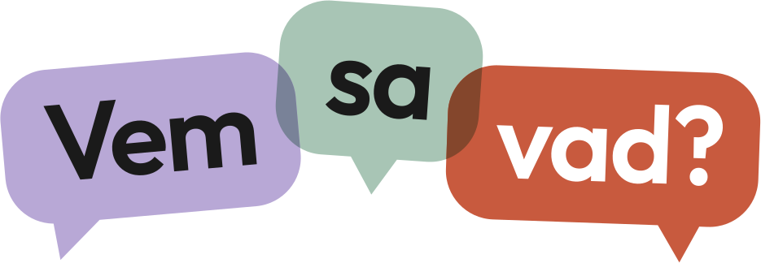
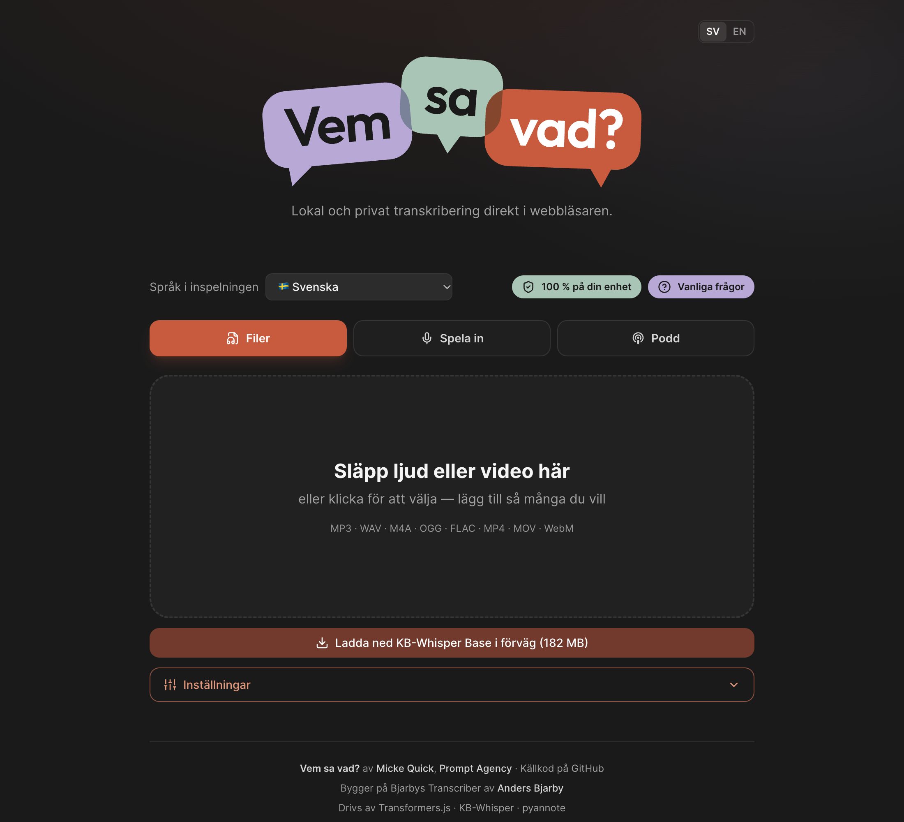

<h1 align="center">
  
</h1>

Private audio and video transcription that runs **in your browser** and tells you **who said what**.
Nothing is uploaded and nothing needs to be installed — just open the page.

**Use it now: [vemsavad.promptagency.se](https://vemsavad.promptagency.se)** — open it in Chrome or
Edge and drop in a file. Click *Install* in the address bar to get it as an app with its own window,
which also opens without a network.

<p align="center">
  
</p>

Vem sa vad? is built on [Bjarbys Transcriber](https://github.com/fltman/bjarbys-transcriber) by
Anders Bjarby, and adds speaker separation and a few other features on top. If you find it useful,
consider [supporting him on Patreon](https://www.patreon.com/AndersBjarby).

## Features

- 🎙️ **Files, microphone or podcasts** — drop several audio or video files (MP3, WAV, M4A, OGG, FLAC,
  MP4, MOV, WebM), record from the microphone, or search for a podcast and pick episodes. Everything
  goes into one queue.
- 👀 **Read along** — the transcript grows in a live preview while it's being made.
- 🇸🇪 **Swedish that actually works** — [KB-Whisper](https://huggingface.co/KBLab) from the National
  Library of Sweden, plus multilingual and English Whisper models. The multilingual ones detect the
  language themselves.
- 🗣️ **Who said what** (optional) — lines are marked *Talare 1*, *Talare 2*… and you can give the
  speakers names. Works for up to three voices at a time.
- ✏️ **Check and correct** — play any line, see the lines the app is unsure of, fix text and speakers,
  and use find & replace for names it keeps getting wrong.
- 📖 **Word list** — add the names and terms in your recordings, and the app suggests corrections
  where it heard something that sounds like them ("Hedsner" → Hetzner). Nothing changes until you
  accept.
- 📄 **Readable documents** — `.txt` or `.md` with a paragraph per speaker turn and optional
  timestamps, or subtitles (`.srt`, `.vtt`) and `.json`. Pick several and get them in one `.zip`;
  downloads can start by themselves as each transcript finishes.
- ⚡ **Fast** — 25 minutes of Swedish in under 3 minutes on a 2021 MacBook Pro.
- 🔒 **Private by design** — see [below](#privacy).
- 💾 **Your choice what's kept** — settings are remembered; finished transcripts are kept in the
  browser only if you say so, until you delete them. Audio is never stored. Downloaded models can be
  removed under Settings › Lagring.
- 🌐 **Swedish or English** interface, with answers to common questions under *Vanliga frågor* (FAQ).

It's made for computers: phones get a page suggesting a computer instead.

## Privacy

The audio and the text never leave your computer. What goes over the network:

- the page itself (from Cloudflare);
- the first time, the transcription model (from Hugging Face) and the compute engine (from jsDelivr) —
  both are then kept in the browser;
- with the Podcast tab, your search term goes to Apple's podcast directory (which also supplies the
  cover images), and feeds and episodes are fetched through the site's own proxy;
- one anonymous visit count to Prompt Agency's own Plausible server in Finland (no cookies; skipped with
  Global Privacy Control or Do Not Track).

The page's Content-Security-Policy stops the browser from contacting anything else, so this can be
checked, not just trusted. The simplest test: transcribe once, turn off the network, and transcribe
again.

## Run it yourself

You need [Node.js](https://nodejs.org) 20.19+ or 22.12+ and git.

```bash
git clone https://github.com/promptagency/vem-sa-vad.git
cd vem-sa-vad
npm install
npm run dev      # open http://localhost:5173
```

- **Use Chrome or Edge** so the models run on the graphics card (WebGPU). Without it the app falls back
  to the processor, which works but is slower.
- **The first transcription downloads the model** (about 110 MB for the default, KB-Whisper Base; about
  180 MB on the processor). After that it starts straight away.
- **`localhost` counts as secure**, so the microphone and WebGPU work without HTTPS.
- **Podcasts work in `npm run dev`**, which includes a stand-in for the podcast proxy;
  `npm run preview` doesn't.

**To host it for others**, `npm run build` gives static files in `dist/` that can be served from any
folder. [docs/hosting.md](docs/hosting.md) covers Cloudflare Pages (what the public site uses), Apache,
the podcast proxy and the security headers.

## Models

| Group | Models | Notes |
|---|---|---|
| **Swedish — KB-Whisper** | tiny · base · small · medium · large | Best Swedish accuracy. `large`/`medium` are big — use WebGPU. |
| **Multilingual — Whisper** | tiny · base · small · large-v3-turbo | ~100 languages, detected automatically from the first 30 s. Turbo is the fast flagship (WebGPU). |
| **English — Whisper** | tiny · base · small (`.en`) | Slightly better on English. |

Each model comes in a few quality levels, with the real download size shown. The defaults are chosen
for your computer; the details are in [docs/architecture.md](docs/architecture.md#quantization).

## Speaker separation

Speaker separation uses [pyannote](https://huggingface.co/pyannote/segmentation-3.0) (about 1.5 MB) and
is off by default. On a hand-labelled 12-minute interview between two people, **95.6%** of the words
went to the right speaker.

Worth knowing before you rely on it:

- **At most three voices at a time.**
- **Short interjections** ("Just det.") said over someone else are the most common mistake. The app
  marks lines it's unsure of, so they're quick to check.
- **Very long recordings** are processed in overlapping parts, which can occasionally produce an extra
  speaker. Files over four hours aren't separated.

How it works, the review view, the export fields and how accuracy is measured:
[docs/speaker-separation.md](docs/speaker-separation.md).

## Speed and accuracy

On a 25-minute Swedish recording (M1 Pro, Chrome, KB-Whisper Base on WebGPU):

| | Before | Now |
|---|---|---|
| Transcription time | 268 s (5.7× real time) | **171 s (8.9×)** |
| Word error rate | 10.4% | **7.2%** |
| Model download | ~206 MB | **~110 MB** |
| Speaker accuracy (real interview) | 94.7% | **95.6%** |

Changes that claim to make things faster or more accurate are measured, not eyeballed — see
[docs/benchmark.md](docs/benchmark.md) for the method and the results, and
[docs/architecture.md](docs/architecture.md) for how the app works inside.

## License

[MIT](LICENSE) © 2026 Anders Bjarby. Vem sa vad?'s additions are released under the same MIT license.
The models are downloaded at runtime from Hugging Face and carry their own licenses: OpenAI Whisper and
KB-Whisper are Apache-2.0, and the
[pyannote segmentation](https://huggingface.co/onnx-community/pyannote-segmentation-3.0) model used for
speaker separation is MIT.
